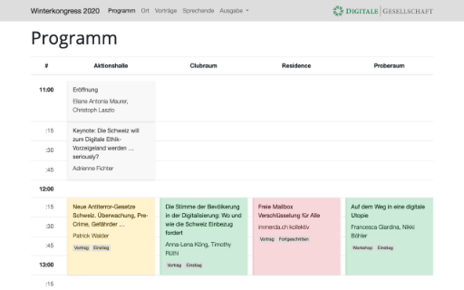

# jekyll-conference



This is a [Jekyll](http://jekyllrb.com) theme based on [Bootstrap 4](http://getbootstrap.com) which can be used to make a simple, responsive website for a one-day conference or workshop with parallel tracks containing:

- program / schedule
- talk and speaker descriptions
- map for directions

All components such as talks, speakers or rooms are represented as collection of files. The schedule is given is defined via a simple structure stored in a [YAML](https://en.wikipedia.org/wiki/YAML) file. There is no need for databases and once generated the website consists only of static files.
The design is easily modifiable and is adapted for mobile uses and printing.

The theme was originally created for the yearly Winterkongress conference of the [Digital Society Switzerland](https://digitale-gesellschaft.ch/). You can see this theme in action here:

- [Demo: Winterkongress](https://digitale-gesellschaft.ch/kongress/)


## Installation

Currently, the theme is not uploaded on [RubyGems](https://rubygems.org/), which is normally used to retrieve Gem-based Jekyll themes. But you can download/clone this repository and reference to it locally:

1. Install Jekyll and Bundler and create a new Jekyll site as described in the [Jekyll documentation](https://jekyllrb.com/docs/)
2. Download this repository and store it somewhere close to the folder containing your new website
3. Change into the newly created folder containing your website and [add the following to the `Gemfile`](https://jekyllrb.com/docs/themes/#installing-a-theme), the `path` section should point to the folder containing the downloaded source of this theme:

   ```ruby
   gem "jekyll-theme-conference", "~> 2.0.0", path: "../jekyll-conference"
   ```

4. Fetch and update bundled gems by running the following [Bundler](http://bundler.io/) command:

   ```bash
   bundle install
   ```

5. Set the `theme` in your project's Jekyll `_config.yml` file (and replace any existing definition):

   ```yaml
   theme: jekyll-theme-conference
   ```

6. Copy the internationalization file containing the different language strings for this theme to your website. It is located under `_data/lang.yml`
7. Continue with the _Setup_ section further below to customize the theme and add some content for your conference

To update the theme simply download this repository again and overwrite your local version of it.


## Setup

The different talks, speakers and rooms are stored as a collection of file. Each file contains a small header in form of a YAML block (called [FrontMatter](https://jekyllrb.com/docs/front-matter/)) which is used to store additional information beside a description. Their exact use and meaning is described further below in the section _Content_. Additional configuration options can be found in the section _Configuration_.

The actual schedule defining when and in which room a talk takes place is stored as a [YAML data file](https://jekyllrb.com/docs/datafiles/) under `_data/program.yml`. For further details about it see below in the section _Content_.

In order to be up and running simply use the default content of this repository as an initial base for your new website. After having setup a new Jekyll website copy the following files and folders into the website's folder:

- `_config.example.yml` -> `_config.yml`
- `_data/`
- `_rooms/`
- `_speakers/`
- `_talks/`
- `index.md`
- `location/`
- `program/`
- `speakers/`
- `talks/`

There exists a Python file in this repository, `create_entries.py`, which can be used to import content from a CSV table and generate the different talk, speakers and room files automatically based on it. Just open your terminal and type `python create_entries.py --help` to show the help and get started.


## Configuration

All configurations and customization for this theme are stored under the `conference` property in the `_config.yml` file. You can find an example configuration containing most of the here discussed parameters under `_config.example.yml` in this repository.

### Collection URLs

The three required collections containing the files for the talks, speakers and rooms have to be specified in the `_config.yml` file. The first block declares them and sets the URL under which they will later be accessed. The second block defines the default layout for each of the collection.

```yaml
collections:
  talks:
    output: true
    permalink: /:collection/:title/
  speakers:
    output: true
    permalink: /:collection/:title/
  rooms:
    output: true
    permalink: /:collection/:title/

defaults:
  - scope:
      path: ""
      type: talks
    values:
      layout: talk
  - scope:
      path: ""
      type: speakers
    values:
      layout: speaker
  - scope:
      path: ""
      type: rooms
    values:
      layout: room
```

_Note:_ While you might want to change the URLs, the name of the three collections (`talks`, `speakers` and `rooms`) is fixed and cannot be changed.


### Language

In order to adapt the language of the theme set the `lang` property. Make sure you have copied the internationalization file from this repository to `_data/lang.yml`. Currently the following languages are supported:

- English: `en` (Default)
- German: `de`
- French: `fr`
- Portuguese: `pt`

Example:

```yaml
conference:
  lang: en
```

### Navigation Bar

The navigation bar is located at the top and visible on every site. On the right it show the title of the website (`site.title`) followed by the links listed under the `links` property of the `navigation` property.  Each link consists of

- the text to show (`name`),
- a relative (`relative_url`) or absolute link address (`absolute_url`) or a collapsed menu listing additional sublinks (`menu`), and
- optionally if it is disabled (`disabled: true`).

Example:

```yaml
conference:
  navigation:
    links:
      - name: Program
        relative_url: /program/
      - name: Previous Editions
        menu:
          - name: 2020 (current)
            disabled: true
          - name: 2019
            relative_url: /2019/
```

Optionally, a logo or link of your organization hosting the conference can be shown on the right side of the navigation bar. It is activate through the `logo` property under the `navigation` property containing

- the text to show (`name`),
- an absolute link address (`url`), and
- optionally a logo to show instead of the text (`img`), whereby the path to the image file relative to the `/assets/images/` folder has to be specified.

Example:

```yaml
conference:
  navigation:
    ...
    logo:
      name: Magic Organisation
      url: 'https://github.com'
```

### Main Landing Page

The main landing page is shown at the root of the website to greet new visitors. In order to show it you need to create a `index.md` file in the root of your website's folder and specify its layout as `layout: main`. The remaining customizations are specified in the `_config.yml` file.

The main page states your site's title (`site.title`) or a logo instead. The logo can be configured through the `logo` property under the `main` property containing:

- a `img` property specifying the path to the image file relative to the `/assets/images/` folder.

Example:

```yaml
conference:
  main:
    logo:
      img: 'main_logo.png'
```

The title/logo on the main page is followed by a description of your site (`site.description`) and the content of your `index.md` file. It ends with an optional list of links in the form of buttons. Each link consists of

- the text to show (`name`),
- a relative (`relative_url`) or absolute link address (`absolute_url`) or a collapsed menu listing additional sublinks (`menu`), and
- optionally if it is disabled (`disabled: true`).

Example:

```yaml
conference:
  main:
    ...
    links:
      - name: Program
        relative_url: /program/
      - name: Tickets
        disabled: true
        absolute_url: ''
```

### Information Boxes

One or multiple information banners or boxes can be shown at the top of the website just below the navigation bar. They are prominent but dismissable and can inform your visitors about recent changes. They are activate through the `info_bars` property which contains a list for each information banner to show. Each banner consists of

- a title (`title`),
- a color (`color`) following the Bootstrap color scheme (see below), possible values are:
  - `primary` (your website's main color, normally blue)
  - `secondary` (your website's secondary color, normally grey)
  - `success` (green)
  - `alert` (red)
  - `warning` (yellow)
  - `info` (blue)
  - `light` (white)
  - `dark` (dark grey)
- an additional text (`text`, markdown supported),
- the option to show it on all pages, only the main landing page (`main_only: true`), or all pages except the main landing page (`pages_only: true`).

Example:

```yaml
conference:
  info_bars:
    - title: Sold Out!
      color: primary
      main_only: true
      text: |
        We're truly sorry but we are sold out.

        ---

        Try again next year.
```

### Talk Settings: Main Categories

Each talk can have one or multiple categories associated via FrontMatter (see the _Individual Pages: Talks_ section below for more details). Some of these categories can be elevated to so called main categories". These are used to color group the talks across the entire website, particularly in the program. In order to do so add the `main_categories` property under the `talks` property. It consists of a list of all main categories. Each main category consists of:

- its name (`name`, must be corresponding to the listed categories in the talk's FrontMatter), and
- a color (`color`) following the Bootstrap color scheme (see below), possible values are:
  - `primary` (your website's main color, normally blue)
  - `secondary` (your website's secondary color, normally grey)
  - `success` (green)
  - `alert` (red)
  - `warning` (yellow)
  - `info` (blue)
  - `light` (white)
  - `dark` (dark grey)

Example:

```yaml
conference:
  talks:
    # Talk categories
    main_categories:
      - name: Cat A
        color: info
      - name: Cat B
        color: success
```

### Speaker Settings: First name

In the program as well as the speaker's overview the speaker's first name can be abbreviated to its first letter. Of course, you also have the option to not specify a first name for each speaker in the first place. In order to shorten the first name add the `show_firstname: true` setting (default: `false`) to the `speakers` property.

Example:

```yaml
conference:
  speakers:
    show_firstname: false
```

### Location Settings: Hide all and disable map

In case the location of your rooms is obvious (e.g. on a campus) you can decide to disable the location page and links to all the rooms. You still need to create the different rooms as files in the `_rooms/` directory, since they are needed as a reference. But there will not be any link pointing to it (effectively hiding them).
In order to hide all rooms add the `hide: true` setting (default: `false`) to the `location` property.

Alternatively, you can show the rooms as usual but hide the map container on the room overview page. In order to hide only the map add the `map: false` setting (default: `true`) to the `location` property.

Example:

```yaml
conference:
  location:
    hide: true
    map: false
```

### Program Settings

The schedule shown as program can be slightly customized:

- The time steps shown with a new line can be adapted with the `time_steps` setting given in minute (default: `15` minutes)
- Besides the full hour the individual time steps can be hidden by setting `show_alltimes: false` (default: `true`)

Example:

```yaml
conference:
  program:
    time_steps: 15 # in minutes
    show_alltimes: true
```

## Content

The different talks, speakers and rooms are stored as a collection of file. Each file contains a small header in form of a YAML block (called [FrontMatter](https://jekyllrb.com/docs/front-matter/)) which is used to store additional information beside a description.
The actual schedule defining when and in which room a talk takes place is stored as a [YAML data file](https://jekyllrb.com/docs/datafiles/).

### Schedule / Program

The schedule of the conference linking the talks with the rooms and indicating when each talk talks place and how long it goes is set in the `_data/program.yml` file. It consists of an array of rooms each consisting of a

- `room` name (must correspond to one of the room identifier), and
- an array of `talks` which also can be empty `[]`.

The order of the room in the file defines the order of the rooms on the website (program and room listings). Each talk in the array consists of

- a `name` (must correspond to one of the talk identifier),
- a starting time `time_start` given as `H:M` ([`strftime`](http://www.strfti.me) formated), and
- an end time `time_end`.

The array should (manually) be ordered by time. Currently talks can only take place on the same day and multi-day conferences are not supported.

Example:

```yaml
- room: Room A
  talks:
    - name: Vim Impetus Placerat Cotidieque Ad
      time_start: '12:00'
      time_end: '12:45'
    - name: Condimentum Vitae Sapien Pellentesque
      time_start: '12:45'
      time_end: '13:30'
- room: Room B
  talks:
    ...
```

### Talks

Each talk is represented by file in the `_talks/` directory. It must begin with valid [YAML Front Matter](https://jekyllrb.com/docs/frontmatter/) containing

- the talk's `name` (used as identifier),
- one or more existing `speakers` name(s), and
- optionally one or more `categories` of which one should be a main category as defined in the site's configuration
- optionally a list of `links` whereby each link element consist of
  - a `name`, and
  - either an absolute link `href` or a `file` name (of a file stored under `/documents/`)
- optionally `hide: true` if the talk's page should not be linked to.

### Speakers

Each speaker is represented by file in the `_speakers/` directory. It must begin with valid [YAML Front Matter](https://jekyllrb.com/docs/frontmatter/) containing

- the speaker's `name` (used as identifier), as well as its
- `first_name`,
- `last_name`,
- optionally a list of `links` whereby each link element consist of
  - a `name`, and
  - either an absolute link `href` or a `file` name (of a file stored under `/documents/`)
- optionally `hide: true` if the speaker's page should not be linked to.

### Rooms

Each room is represented by file in the `_rooms/` directory. It must begin with valid [YAML Front Matter](https://jekyllrb.com/docs/frontmatter/) containing

- the room's `name`, and
- optionally `hide: true` if the room's page should not be linked to.


## Overview Pages

For each of the three collections there exist a dedicated layout giving an overview among all items of the collection. Furthermore, there exists a layout to show the program as a time schedule. Simply create an empty page and associate the corresponding layout with it:

- `talks/index.md` with `layout: talk-overview`
- `speakers/index.md` with `layout: speaker-overview`
- `location/index.md` with `layout: location`
- `program/index.md` with `layout: program`

They can be empty but should contain the `layout` property in the FrontMatter header.

### Location / Room Overview

The `location` layout contains a map container (if not disabled, see section _Location Settings: Hide all and disable map_ above) which can be adapted. The map is based on the JavaScript Library [Leaflet](https://leafletjs.com/) and can be customized by editing the `assets/js/map.js` file (copy it from this repository).

### Additional Pages

Additional static pages can easily be added as files and linked to via navigation bar or main landing page (see above on how to).


## Design

The design is based on the [Bootstrap 4](http://getbootstrap.com) and thus easily expendable. Furthermore, it makes use of the [FontAwesome Icons](fontawesome.com/) across the theme.
Custom Bootstrap themes or simple color schemes such as designed with [Bootstrap Magic](https://pikock.github.io/bootstrap-magic/) can be added in the [main](assets/css/main.scss) SASS stylesheet:

1. Create a new file under `assets/css/main.scss` with the following content (or copy the one of this repository):

   ```scss
   ---
   ---

   $fa-font-path: '{{ site.baseurl }}/assets/webfonts';

   @import 'conference';
   ```

   Do not skip the `$fa-font-path` variable or modify it as otherwise, the FontAwesome icons will not be able to load.

2. Add your Bootstrap variables in front of the `@import 'conference'` line, e.g. currently the primary color is set internally to green (instead of Bootstrap's default blue): `$primary: #074 !default;`
3. Add any additional CSS styles after it.


## License

This project is licensed under the MIT License. You can view [LICENSE.md](LICENSE.md) for more details.

This project redistributes other opensource tools and libraries. You can view [REDISTRIBUTED.md](REDISTRIBUTED.md) for third party licenses.
