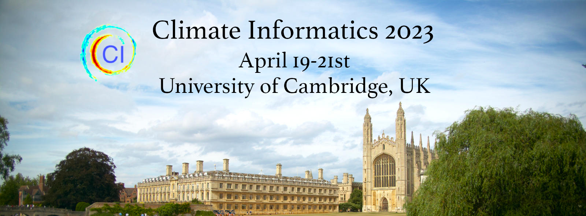

## 12th International Conference on Climate Informatics

### About the Conference

The Institute of Computing for Climate Science at the University of Cambridge
is pleased to announce the 12th International Conference on Climate Informatics, which will be hosted at
the university in April 2022.

The Climate Informatics conference series aims to bring together researchers and users across different disciplines and sectors to forge international collaboration between climate science, data science, and computer science, share state-of-art developments in climate data and informatics, and accelerate the rate of discovery in climate science and adaptation of climate applications.
